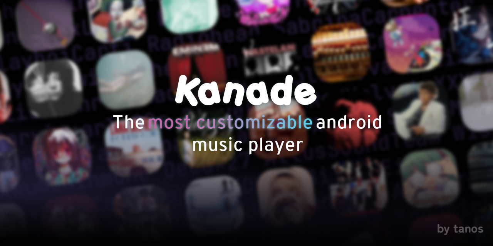

# Myoraei

_This file was made incase the structure wasn't clear, or gets confusing after a while._

_(Last updated: 22-12-2025, structure is currently old)_

## Structure

### Core App Files (`app/`)

| File           | Purpose                       | Importance               |
| -------------- | ----------------------------- | ------------------------ |
| `_layout.tsx`  | Root layout, wraps entire app | 🔴 Critical - runs first |
| `index.tsx`    | Entry redirect                | 🔴 Critical              |
| `player.tsx`   | Full-screen music player      | 🟡 High - main feature   |
| `settings.tsx` | App settings screen           | 🟢 Low                   |
| `demo.tsx`     | Demo home screen              | 🟢 Low                   |

### Tab Screens (`app/(tabs)/`)

| File            | Purpose                  | Call Frequency     |
| --------------- | ------------------------ | ------------------ |
| `_layout.tsx`   | Tab bar + navigation bar | 🔴 Always loaded   |
| `index.tsx`     | Home screen loader       | 🔴 Most viewed     |
| `songs.tsx`     | All songs list           | 🟡 Frequently used |
| `playlists.tsx` | Playlist management      | 🟡 Frequently used |

### Components (`components/`)

| File               | Purpose                 | Reusability              |
| ------------------ | ----------------------- | ------------------------ |
| `Home.tsx`         | Home screen + stats     | 🔴 Main screen           |
| `MiniPlayer.tsx`   | Bottom mini player bar  | 🔴 Shows on every screen |
| `SongCard.tsx`     | Individual song row     | 🔴 Used everywhere       |
| `PlaylistCard.tsx` | Playlist thumbnail card | 🟡 Playlists screen      |

### State Management (`store/`)

> This part was made with the help of AI

| File               | Purpose                              | Importance            |
| ------------------ | ------------------------------------ | --------------------- |
| `playerStore.ts`   | Playback state (current song, queue) | 🔴 Core functionality |
| `songStore.ts`     | Song library, liked songs, stats     | 🔴 Core data          |
| `playlistStore.ts` | Playlist CRUD operations             | 🟡 High               |

### Utilities (`utils/`)

> Database was made with the help of AI

| File              | Purpose                     | When Called             |
| ----------------- | --------------------------- | ----------------------- |
| `database.ts`     | SQLite operations (native)  | 🔴 Every data operation |
| `database.web.ts` | Web localStorage            | 🟢 Web only             |
| `mediaScanner.ts` | Scan device for music files | 🟡 On scan/refresh      |

### Config Files

| File                 | Purpose                    |
| -------------------- | -------------------------- |
| `app.json`           | Expo app config (ignore)   |
| `package.json`       | Dependencies (ignore)      |
| `tsconfig.json`      | TypeScript config (ignore) |
| `metro.config.js`    | Bundler config (ignore)    |
| `constants/theme.ts` | Colors, spacing, fonts     |

## How was AI used in this project, and should I be concerned?

AI was primarily used to help creating databases, the zustand stores and making the animations for the actions. Even though AI was used, that does not mean that the quality of the code is bad or unoptimized as I've been reviewing it all.
